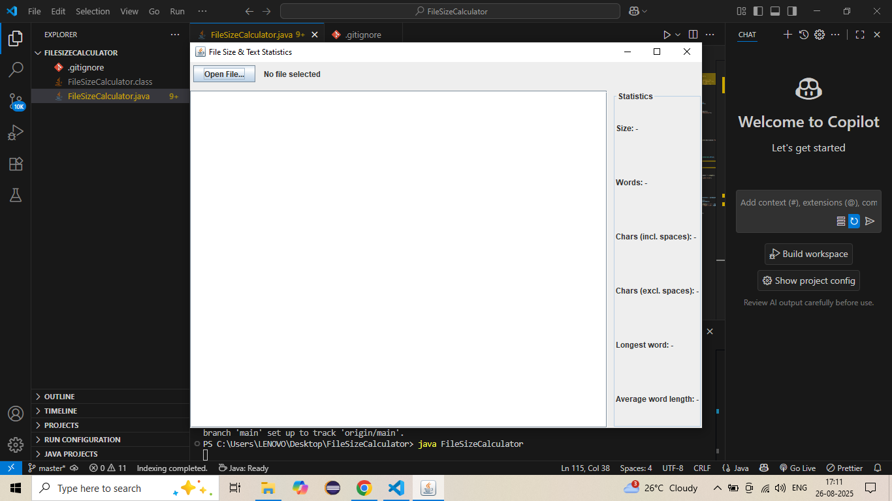
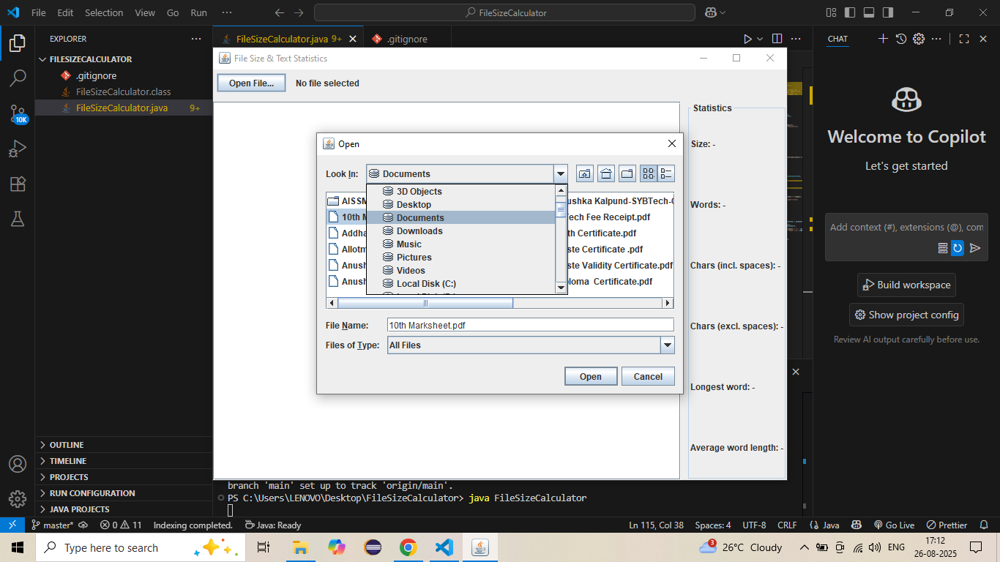

# 📂 File Size Calculator (Java Swing)

A beginner-friendly **Java Swing application** to calculate and display basic statistics of a text document.  
This tool allows users to upload a `.txt` file and instantly see details like file size, word count, character count, and more.  

---

## ✨ Features
- 📁 **File Selection** – Choose `.txt` files using a file chooser dialog.  
- 📊 **File Size Calculation** – Displays file size in **Bytes, KB, or MB**.  
- 📝 **Word & Character Count** – Counts words, characters (with and without spaces).  
- 🔍 **Extra Statistics** – Longest word and average word length.  
- 🖥️ **Simple User Interface** – Built with **Java Swing**.  
- ✅ **Beginner-Friendly** – Great practice project for Java learners.  

---

## 🛠️ Tech Stack
- **Language:** Java (JDK 21 recommended, works with JDK 8+)  
- **UI Framework:** Java Swing  
- **Editor/IDE:** VS Code (with Java Extension Pack)  

---


## 📷 Screenshots





---

## 🚀 Getting Started

### 1. Clone this repository
```bash
git clone https://github.com/<your-username>/FileSizeCalculator.git
cd FileSizeCalculator
